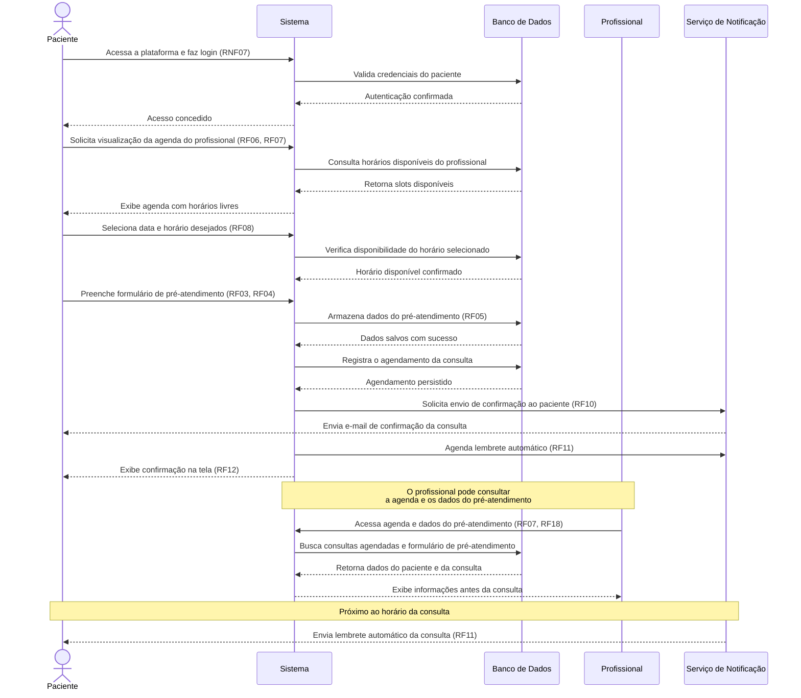
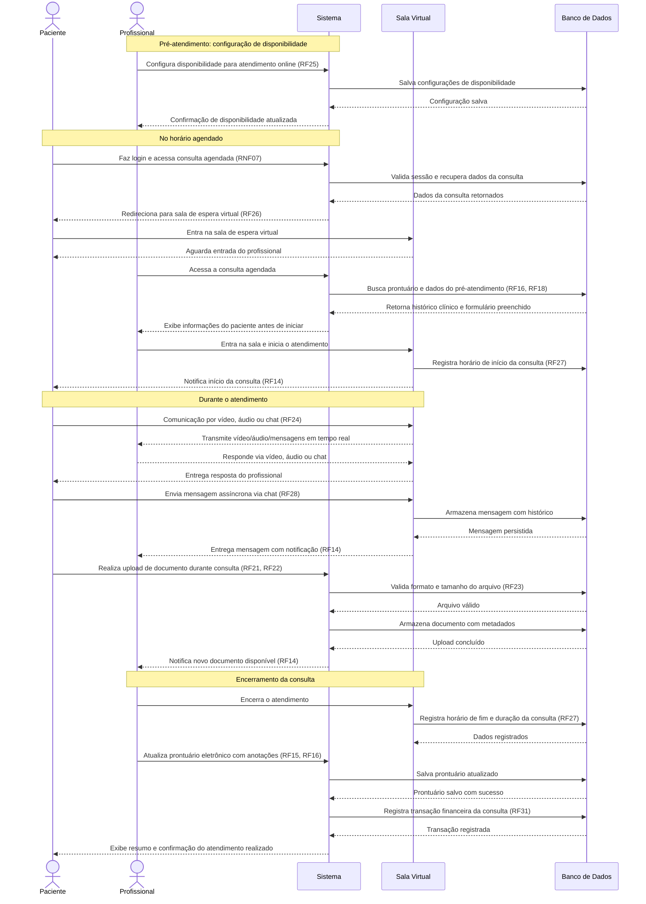

# Diagramas de Sequência

---

## 1. Agendamento de Consulta

**Participantes:**
- `Paciente` — usuário que solicita a consulta
- `Sistema` — aplicação web/mobile
- `Banco de Dados` — persistência dos dados
- `Profissional` — médico/terapeuta responsável
- `Serviço de Notificação` — envio de e-mails e lembretes

---

## 2. Atendimento Online

**Participantes:**
- `Paciente` — usuário que participa da teleconsulta
- `Sistema` — aplicação web/mobile
- `Sala Virtual` — módulo de videochamada/chat
- `Banco de Dados` — persistência dos dados
- `Profissional` — médico/terapeuta que conduz o atendimento

*Referências aos Requisitos utilizados nos diagramas:*

| Código | Descrição resumida |
|--------|--------------------|
| RF03, RF04, RF05 | Pré-atendimento e formulário online |
| RF06, RF07, RF08 | Agendamento e acesso à agenda |
| RF10, RF11, RF12 | Confirmações e lembretes automáticos |
| RF14 | Notificações em tempo real |
| RF15, RF16 | Prontuário eletrônico e histórico clínico |
| RF18 | Consulta de dados do pré-atendimento e prontuário |
| RF21, RF22, RF23 | Upload, download e validação de documentos |
| RF24, RF25, RF26 | Atendimento online, disponibilidade e sala virtual |
| RF27, RF28 | Registro de dados e mensagens assíncronas |
| RF31 | Registro financeiro |
| RNF07 | Autenticação por login e senha |
