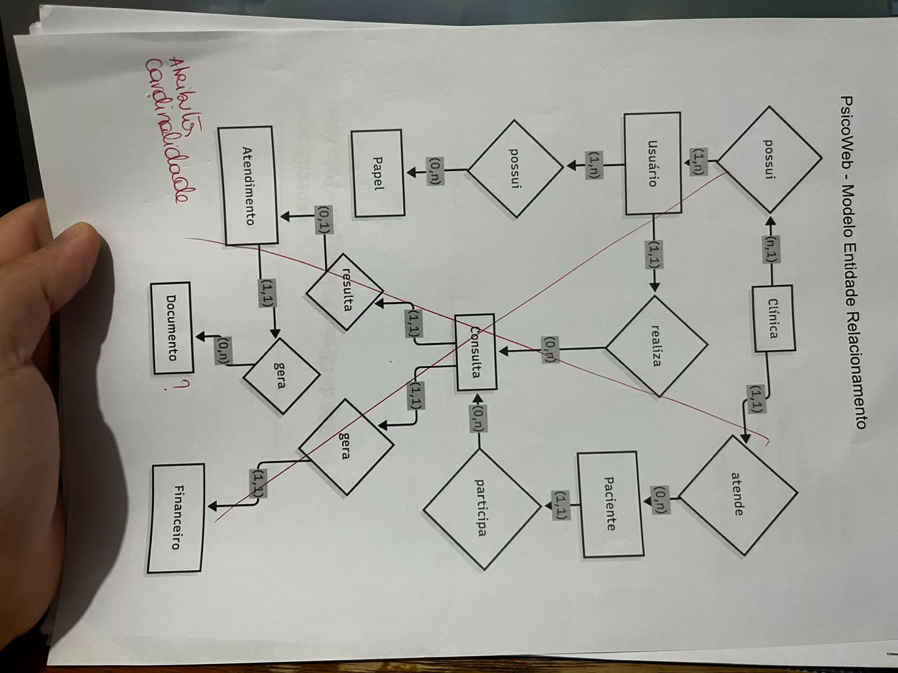

* De 1 tiramos 0

Comentarios da professora:
> Revisar todas as cadinalidades 
 

> Como o diagrama mostra o vinculo do paciente para o psicologo? 
 

> Quais documentos são gerados?   

> O diagrama mistura relacional com estrutural 

### Basicamente
---------
O modelo que fizemos está certo, mas não deveria ter ações como "gera", por que isso é estrutural.  
Devemos ir atrás de entender quais são de fato os documentos gerados, buscar modelos e entender eles.  

---------
#### Proxima abordagem

Após realinharmos o novo escopo, reescrever respeitando apenas os relacionamentos, sem conceitos de estrutura.