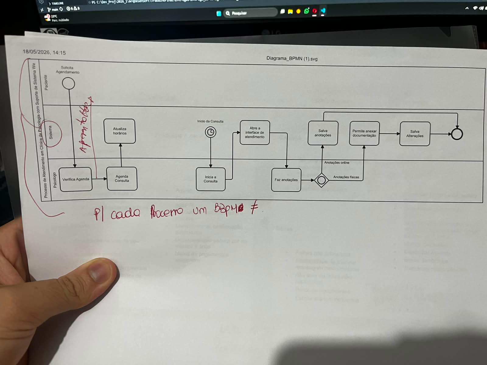

* De 1 tiramos 0

Comentarios da professora:
> As raias já são o sistema 
 

> Ele deve conter todo o contexto do sistema
 

> Pode ser feito mais de um BPMN

### Basicamente
---------
O BPMN está incompleto, devemos fazer alguns outros que engoblam todo o contexto do sistema, não só o de agendar consulta.
 
E sobre o modelo que utilizamos: Parece certo no contexto geral, mas as raias já são o sistema, sem necessidade de ter uma para sistema. 

---------
#### Proxima abordagem

Achar um outro material de estudo para poder atualizar o BPMN que não seja o vídeo antes visto e refazer os fluxos devidos. 
Já considerando o novo escopo do projeto, pós reunião de realinhamento.