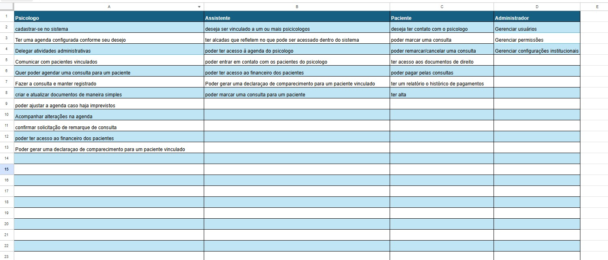
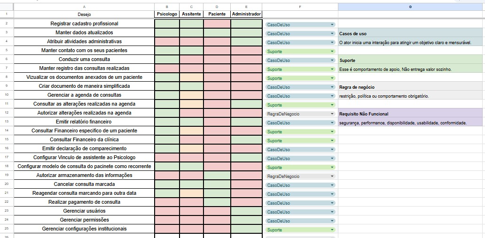
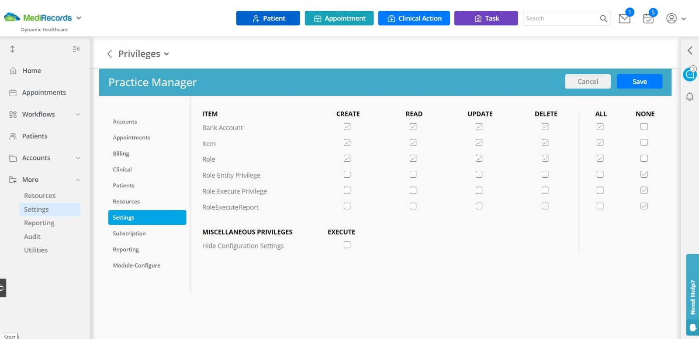
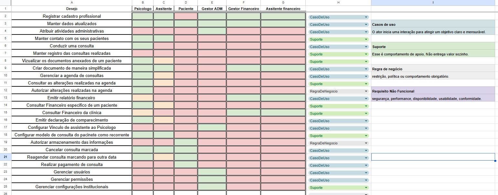

# Anotações

Esse documento e branch são para atualizações diárias das ideias do projeto. A ideia do arquivo veio após um desentendimento com a professora que questionou nossa linha de evolução, por isso esse markdown terá uma linguagem informal e relatará todas as ideias e reescritas de codigos.
-----------------------------------------------------------------------------------------------------------------------------------------------------------------------------------------------------------------------------------------------------------------------------------------------------

## 08/04

Na ultima aula (06/04), a professora questionou alguns documentos que não fizemos e alguns mais avançados que foram feitos errados. Por isso vamos atrás de uma reestruturação:

- Precisamos fazer um questionário melhor, que tenha perguntas voltadas ao sistema.
- Desenvolver o BPMN
- Criar um casos de uso melhor, pois o ultimo não era casos de uso

### O que fazer:

Aproveitando a aula de hoje, irei fazer uma reunião com os participantes do grupo e desenvolver um questionário melhor, assim que feito iremos atualizar os requisitos mais uma vez e a partir dai reestruturar nosso projeto.

### também tive uma ideia que podemos implementar no projeto:

Podemos desenvolver (talvez - **questionar a professora sobre a implementação disso**) uma conexão com o paciente, aonde ele vai ter um sistema para fazer anotações de coisas que acontecem entre uma sessão e outra, assim o psicologo poderá ler as anotações feitas e assim questionar o que achar necessário.
A ideia veio de um caso pessoal, onde no dia seguinte de uma consulta houve uma situação que seria importante de ser comentada,
mas ainda faltavam 6 dias até a próxima sessão, e por isso possivelmente será esquecido.

---

## 09/04

Não houve aula na data de hoje, e nos reunimos para tratar as ideias do projeto, participaram: Dylan, Guilherme, Myllena - Participantes de fora da turma: Arthur {Monitor}, Henrique {Ex aluno}, Laiz {Colega}, tratamos o assunto e aprofundandos um pouco melhor as ideias do projeto.

### Questionario:

Definimos que é necessário refazer o questionário para poder ter um entendimento melhor do que queremos no nosso projeto, para isso foram feitas algumas perguntas internas que será transformadas em um formulário

```
- O que o psicologo espera de um sistema?
- Como funciona o pré atendimento?
- Um cadastro deve ter o status INATIVO? se sim, quanto tempo de abandono é necessário apra mudar o status? 
- O diário (funcionalidade do sistema) é algo viável?
- Caso o diário for aceito, o psicologo pdeveria ver as anotações?
- Como é feito atualmetne a visualização das consultas marcadas e horários livres
- Como seria uma forma prática de mostrar as datas e consultas?
    -> Talvez gerar um modelo do que queremos na IA e validar se seria interessante
- Quais documentações são geradas ao longo de um tratamento com paciente?
- Quais orgãos regulamentam o processo de psicologia?
```

> Imagens estão anexadas na pasta imagens/09_04_Quadro/

Esses questionamentos serão reprocessados e esperamos ter um questionário até sabado (em 2 dias), para isso irei criar uma branch somente de questionário e nela vamos anexar as evoluções das perguntas e respostas.
Após isso planejamos distribuir e receber respostas ao longo da semana do dia 13 a 17, aproveitando o periodo de provas para não estar tão focado, a assim que respondidas fazer a reanálise de requisitos em conjunto.

---

## 10/04

No dia de hoje, trabalhamos pelo whatsapp para poder desenvolver o questionario, foram levantadas perguntas baseado no nosso entendimento do sistema, em ensinamentos de aulas no youtube e baseado nas perguntas levatandas na reuniao de ontem.
a criação do arquivo teve participacão majoritario do Matheus e o desenvolvimento das perguntas ficaram por conta do Dylan e Guilherme, com validações realizadas pela myllena.

> Toda a documentação foi anexada na pasta questionrio_versoes/segunda_versão

proxima etapa (para até quarta), sera a diatribuicao dos questionairos para coleta de informação

---

## 12/04

Hoje foi um dia parado para o projeto, sendo apenas evoluido com a resposta de um psicologo ao questionario, e eu (dylan) comecei a estudar sobre BPMN e gerei o primeiro modelo, que será melhorado:


## 27/04

Hoje voltamos a trabalhar no projeto e eu (Dylan) fiz um levantamento de requisitos baseado no sistemana análogo, sendo essa a segunda versão. Foi levantando as principais funcionalidades e armazenada no caminho:

*Branch main - Docs/input/Analogo/segunda_versao_analogo/analise_de_requisitos_analogo.md*

Foi apenas um levantamento de funcionalidades, irei ainda hoje transformar em frases de funcionalidades para depois transformar em requisitos de fato.

----------

Elaborei também um calendario até a entrega da segunda etapa, para que dê tempo de fazer tudo e revisar

~~~
Até 29/04 -> Dylan irá fazer uma reanalise do sistema analogo e dos questionarios e fazer um levantamento de requisitos;

29/04 -> no primeiro horário a equipe irá fazer uma reuniao para discutir os requisitos levantados e os fluxos do sistema, alem de separar os requisitos para que sejam escritos de forma formal (segundo as ultimas atividades e o livro do larman);

Até 04/05 -> fazer a escrita formal dos requisitos, que estará separado em partes iguais entre os integrantes do grupo;

06/05 -> junção dos requisitos, validação de conformidade e divisão de responsabilidades para a tarefa de criar diagramas da entrega II;

Até 09/05 -> cada um desenvolver seus proprios diagramas designados;

10/05 -> Essa etapa está destinada a juntar tudo em um documento e o Antonio gera a ABNT do documento e a gente faz uma validação final;

13/05 -> entrega
~~~

## 29/04

na data de hoje houve bons avanços no projeto. Eu (Dylan) elabolei o documento de requisitos em sua versão inicial e fizemos a reunião de análise, pontos foram levantados, incluindo a superficialidade do documento e os pontos que devem ser alterados, esperamos amanhã continuar discutindo sobre para melhorar ainda mais o projeto.

Pontos a se desenvolver:
- Requisitos relacionados a documentação anexada pelo psicologo
- Requisitos quye diz respeito a parte financeira
- Requisitos relacionados a todas as interaqções do paciente
- Requisitos sobre a hierarquia de acessos e seus cadastros
- outros

*Branch main - Docs/Requisitos_Rastreabilidade/Requisitos/segunda_versao_requisitos/Requisitos_V0.1.pdf*

integrantes da reunião: Dylan, Myllena, Antônio, Guilher e Eduardo. 

## 30/04

Na quinta feira pós prova, fizemos apenas alguns avanços no documento de requistos e definimos um outro caminho para fazer a elicitação. Cada integrante (exceto Matheus) pegou um tópico que que estava ainda superficial na V0.1, e com isso definimos um tipo de documento para descrever como seria o fluxo que queremos, assim no domingo (03/05) queremos fazer uma reuniao online para todos lerem e assim definir se o fluxo está certo, e ai sim melhorarmos os requistos com um embasamento do processo real:

| Tópico | Responsável |
|:--------:| --------:|
| Financeiro   | Dylan    |
| Doc. gerada   | Guilherme    |
| Cadastro   | Myllena    |
| Calendário   | Antônio    |
| Armazenamento de info.   | Eduardo    |

 Esperado para a próxima interação: Até sabado 02/05 os iuntegrantes devem gerar a documentação para no domingo tratarmos. 

## 03/05

Alguns planos do final de semana foram frustrados. A reunião que haviamos marcado para hoje não ocorreu por alguns imprevistos com 3 colegas (Myllena, Antônio e Guilherme), mas isso acontece, e decidimos fazer uma análise dos levantamentos amanhã antes/durante a aula. Cada um fez a sua parte, porem Myllena e Guilherme não conseguiram anexar no documento final, então ao final do dia 03 a versão deles não está no documento. 
Como esperado, o integrante Matheus não participou de nenhuma atividade ou mesmo análise de artefatos que iamos mandando para validação de todos no grupo do whatsapp. 
<br>
Visando não atrasar muito nossa entrega, busquei (dylan) atualizar nossa documentação de forma a já fazer os entregaveis do tipo "glossário" da maneira que se espera na entrega. Já fiz também os documentos de Value Proposition e Documento visão, foram anexados na main na data de 03/05 e 04/05 na pasta \docs\3.Docs_negocio\
<br><br>
Plano Futuro: Para amanhã desejo revisar todo o fluxo de fato, para durante a noite eu fazer o levantamento apurado e atualizado de requisitos, garantindo que todos os integrantes vão visualizar o projeto da mesma forma, funcionalidades e restrições. após isso vou dividir os casos de uso para que todos façam pelo menos 2 ou 3, e após isso dividir o restante dos entegaveis para que o grupo faça (como documento suplementar, telas, entidade relacionamento...)

## 04/05

*Observação antes do relatório: O integrante Matheus Pains saiu do grupo nesta segunda feira, após deversas semanas sem agregar ao projeto ou mesmo demonstrar interesse em se recolocar.*
<br>
Na data de hoje a professora não pode ministrar a aula, e por isso alguns artefatos que queria validar com ela ficaram em suspenso até a aula de 06/05; aproveitando o tempo, a equipe decidiu se reunir para discutir sobre os fluxos atuais: 
~~~
Integrantes:
Myllena
Dylan
Antônio
Eduardo
~~~

O fluxo, como acredito já ter falado, se trata da nossa interpretação de como o sistema deve se comportar, ele mistura tudo: Requistos funcionais, não funcionais, regras de negócio e tudo o que tem direito. O nosso objetivo é alinhar 100% do funcionamento para apartir deste ponto fazer um lavantamento suficientemente completo. No momento atual, a versão do documento de fluxo é a V0.5, Commitada pelo Matheus - A Integração dele foi gerada por IA e iremos validar com um pouco mais de cuidado, garantindo coesão e acoplamento com o restante do projeto.
Quanto a essa versão que geramos, algumas alterações foram analizadas durante a reunião:
- Metodo de pagamento pos-pago define inadimplencia quando uma consulta está pendente e uma segunda consulta é realizada. Ex: A consulta de 03/05 está pendente, so me torno inadimplete quando eu realizar uma segunda consulta SEM pagar a em aberto.<br>
- Nas telas previas geradas no figma, o extrato financeiro possui algumas abas de saldo: <br>
| Valor acordado | Valor Pago | Saldo Final | <Br>
Validamos a necessidade de que o saldo final apresente o "-" antes do valor, possibilitando o saldo ser "R$0,00" onde não há valores pendentes, ou negativo, que significa valores em aberto
- Ao psicologo entrar em um horário de consulta, no sistema ele terá um botão de "iniciar consulta", que exibirá para ele o modo de atendimento (inpirado no CodeSpace do Github) que seria um ambiente gerado para facilitar o acesso do psicologo aos dados do paciente, que ele poderá gerar anotações que serão vinculadas diretamente ao paciente, por que o modo de atendimento depende de uma consulta, que é vinculada diretamente no ID do paciente. <br>
O modo atendimento conta o tempo definido pelo psicologo como o padrão de consulta (ele precisa definir isso no seu cadastro pessoal) e assimm que acabar a consulta, o psicologo pode finalizar e o status passa a ser "Finalizando documentação", o objetivo é que o psicologo entenda que o tempo acabou, mas que ainda possa realizar suas atualizações documentais e anotações, para então sair do modo qunado quiser <Br>

```text
[Iniciar consulta]
      |
      v
[Modo atendimento]
      |
      v
[Registrar anotações]
      |
      v
[Tempo expirou] -> Logs de finalização de consulta com paciente são gerados
      |
      v
[Finalizando documentação]
      |
      v
[Encerramento manual] -> Todas as documentações são salvas
```

- Link de remarcar consulta expecifico para o paciente: A ideia (inspirado em sistam de remarcar de barbearia) consiste em quando uma consulta for realizada, o psicologo poder remarcar a consulta manualmente ao final, mas se não for feito, o psicologo pode enviar um link para o paciente para remarcar <br>
Diferencial: O Link vai ser gerado PARA o cadastro do usuário, assim, ao acessar o link (que expira em 1 hora, ou torna invalido após realizar uma reserva) o paciente possa marcar a proxima consulta sem precisar de fazer loggin ou acessos, e o link deve mostrar a agenda (apenas) do doutor e permitir que o paciente escolha quando se encaixar.

## 06/05

Hoje, quarta feira, a professora não conseguiu estar presente para mistriar a aula por que estava internada, aproveitamos essa oportunidade para mais uma vez dar um passo atras no projeto, mas dessa vez de forma *RAPIDA*. O estado em que deixamos o projeot ontem era: <Br>
definimos algumas restriçoes e casos de uso, uma nova modalidade de cadastrar uma consulta.
<Br>
Mas o que de fato está sendo o problema que vejo, todo o levantamento de requisitos está sendo feito de uma forma muito superficial, ou toda vez que fazemos uma reuniao as coisas são redefinidas. pensando nisso decidimos abstrair, definir uma pequena lista de desejos de casa perfil:



Isso nos ajudou a entender melhor as funcionalidades e pensando em não fazer essa repetição de mesmas funções, desenvolvi (Dylan) uma matriz desses desejos, já dando uma reformulada nos nomes e deixando menos abstraidos



A ideia é definir os desejos e quem pode querer a mesma coisa. Ficou bom (sem muita humildade nessa fala), mas em grupo definimos um problem, o que de fato é o ADM? uma entidade, um usuário? um nivel de credenciamento? <Br>
A resposta definida em grupo foi: *RBAC* - o modelo nos ajudou a definir os "papeis" que os usuários podem ter e até mesmo algumas regras de negócio.<Br>
Em uma de nossas pesquisas achamos uma inspiração

E junto dessa inspiração pensei no meu sistema de trabalho *SAPO.Frogpay* que só mostra botoes funcionais, dessa forma desenvolvemos o que seria o papel de adminitrador, ele pode conceder os acessos e limiações, aprovar cadastros e tudo mais, ao mesmo que não deixa de ser um psicologo ou um gerente. Dessa forma atualizamos a matriz de desejo para comportar essa nossa escolha, fortalecendo ainda mais a base do nosso projeto:


Importante anotar as seguintes ideias:
* Para cadastrar um novo funcionario, algum dos ADM permitidos deve gerar um link de cadastro, para que o novo funcionario acesse e anexe a documentação, e depois de feito a solicitação volta para o adm analisar e decidir quais serão as alçadas/papeis no sistema para ai liberar de fato o acesso dele.
* O psicologo deve ter na matriz de credenciamento a opção de ministrar os acessos do assistente vinculado à ele.
* Mais de uma pessoa pode gerir a administração, basta que o primeiro conceda esse papel ao outro usuário.