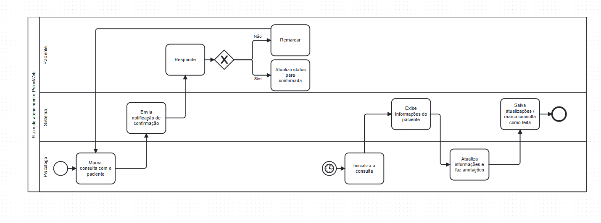

# Anotações

Esse documento e branch são para atualizações diárias das ideias do projeto. A ideia do arquivo veio após um desentendimento com a professora que questionou nossa linha de evolução, por isso esse markdown terá uma linguagem informal e relatará todas as ideias e reescritas de codigos.
-----------------------------------------------------------------------------------------------------------------------------------------------------------------------------------------------------------------------------------------------------------------------------------------------------

## 08/04

Na ultima aula (06/04), a professora questionou alguns documentos que não fizemos e alguns mais avançados que foram feitos errados. Por isso vamos atrás de uma reestruturação:

- Precisamos fazer um questionário melhor, que tenha perguntas voltadas ao sistema.
- Desenvolver o BPMN
- Criar um casos de uso melhor, pois o ultimo não era casos de uso

### O que fazer:

Aproveitando a aula de hoje, irei fazer uma reunião com os participantes do grupo e desenvolver um questionário melhor, assim que feito iremos atualizar os requisitos mais uma vez e a partir dai reestruturar nosso projeto.

### também tive uma ideia que podemos implementar no projeto:

Podemos desenvolver (talvez - **questionar a professora sobre a implementação disso**) uma conexão com o paciente, aonde ele vai ter um sistema para fazer anotações de coisas que acontecem entre uma sessão e outra, assim o psicologo poderá ler as anotações feitas e assim questionar o que achar necessário.
A ideia veio de um caso pessoal, onde no dia seguinte de uma consulta houve uma situação que seria importante de ser comentada,
mas ainda faltavam 6 dias até a próxima sessão, e por isso possivelmente será esquecido.

---

## 09/04

Não houve aula na data de hoje, e nos reunimos para tratar as ideias do projeto, participaram: Dylan, Guilherme, Myllena - Participantes de fora da turma: Arthur {Monitor}, Henrique {Ex aluno}, Laiz {Colega}, tratamos o assunto e aprofundandos um pouco melhor as ideias do projeto.

### Questionario:

Definimos que é necessário refazer o questionário para poder ter um entendimento melhor do que queremos no nosso projeto, para isso foram feitas algumas perguntas internas que será transformadas em um formulário

```
- O que o psicologo espera de um sistema?
- Como funciona o pré atendimento?
- Um cadastro deve ter o status INATIVO? se sim, quanto tempo de abandono é necessário apra mudar o status? 
- O diário (funcionalidade do sistema) é algo viável?
- Caso o diário for aceito, o psicologo pdeveria ver as anotações?
- Como é feito atualmetne a visualização das consultas marcadas e horários livres
- Como seria uma forma prática de mostrar as datas e consultas?
    -> Talvez gerar um modelo do que queremos na IA e validar se seria interessante
- Quais documentações são geradas ao longo de um tratamento com paciente?
- Quais orgãos regulamentam o processo de psicologia?
```

> Imagens estão anexadas na pasta imagens/09_04_Quadro/

Esses questionamentos serão reprocessados e esperamos ter um questionário até sabado (em 2 dias), para isso irei criar uma branch somente de questionário e nela vamos anexar as evoluções das perguntas e respostas.
Após isso planejamos distribuir e receber respostas ao longo da semana do dia 13 a 17, aproveitando o periodo de provas para não estar tão focado, a assim que respondidas fazer a reanálise de requisitos em conjunto.

---

## 10/04

No dia de hoje, trabalhamos pelo whatsapp para poder desenvolver o questionario, foram levantadas perguntas baseado no nosso entendimento do sistema, em ensinamentos de aulas no youtube e baseado nas perguntas levatandas na reuniao de ontem.
a criação do arquivo teve participacão majoritario do Matheus e o desenvolvimento das perguntas ficaram por conta do Dylan e Guilherme, com validações realizadas pela myllena.

> Toda a documentação foi anexada na pasta questionrio_versoes/segunda_versão

proxima etapa (para até quarta), sera a diatribuicao dos questionairos para coleta de informação

---

## 12/04

Hoje foi um dia parado para o projeto, sendo apenas evoluido com a resposta de um psicologo ao questionario, e eu (dylan) comecei a estudar sobre BPMN e gerei o primeiro modelo, que será melhorado:



## 27/04

Hoje voltamos a trabalhar no projeto e eu (Dylan) fiz um levantamento de requisitos baseado no sistemana análogo, sendo essa a segunda versão. Foi levantando as principais funcionalidades e armazenada no caminho:

*Branch main - Docs/input/Analogo/segunda_versao_analogo/analise_de_requisitos_analogo.md*

Foi apenas um levantamento de funcionalidades, irei ainda hoje transformar em frases de funcionalidades para depois transformar em requisitos de fato.

----------

Elaborei também um calendario até a entrega da segunda etapa, para que dê tempo de fazer tudo e revisar

~~~
Até 29/04 -> Dylan irá fazer uma reanalise do sistema analogo e dos questionarios e fazer um levantamento de requisitos;

29/04 -> no primeiro horário a equipe irá fazer uma reuniao para discutir os requisitos levantados e os fluxos do sistema, alem de separar os requisitos para que sejam escritos de forma formal (segundo as ultimas atividades e o livro do larman);

Até 04/05 -> fazer a escrita formal dos requisitos, que estará separado em partes iguais entre os integrantes do grupo;

06/05 -> junção dos requisitos, validação de conformidade e divisão de responsabilidades para a tarefa de criar diagramas da entrega II;

Até 09/05 -> cada um desenvolver seus proprios diagramas designados;

10/05 -> Essa etapa está destinada a juntar tudo em um documento e o Antonio gera a ABNT do documento e a gente faz uma validação final;

13/05 -> entrega
~~~

## 29/04

na data de hoje houve bons avanços no projeto. Eu (Dylan) elabolei o documento de requisitos em sua versão inicial e fizemos a reunião de análise, pontos foram levantados, incluindo a superficialidade do documento e os pontos que devem ser alterados, esperamos amanhã continuar discutindo sobre para melhorar ainda mais o projeto.

Pontos a se desenvolver:
- Requisitos relacionados a documentação anexada pelo psicologo
- Requisitos quye diz respeito a parte financeira
- Requisitos relacionados a todas as interaqções do paciente
- Requisitos sobre a hierarquia de acessos e seus cadastros
- outros

*Branch main - Docs/Requisitos_Rastreabilidade/Requisitos/segunda_versao_requisitos/Requisitos_V0.1.pdf*

integrantes da reunião: Dylan, Myllena, Antônio, Guilher e Eduardo. 

## 30/04

Na quinta feira pós prova, fizemos apenas alguns avanços no documento de requistos e definimos um outro caminho para fazer a elicitação. Cada integrante (exceto Matheus) pegou um tópico que que estava ainda superficial na V0.1, e com isso definimos um tipo de documento para descrever como seria o fluxo que queremos, assim no domingo (03/05) queremos fazer uma reuniao online para todos lerem e assim definir se o fluxo está certo, e ai sim melhorarmos os requistos com um embasamento do processo real:

| Tópico | Responsável |
|:--------:| --------:|
| Financeiro   | Dylan    |
| Doc. gerada   | Guilherme    |
| Cadastro   | Myllena    |
| Calendário   | Antônio    |
| Armazenamento de info.   | Eduardo    |

 Esperado para a próxima interação: Até sabado 02/05 os iuntegrantes devem gerar a documentação para no domingo tratarmos. 